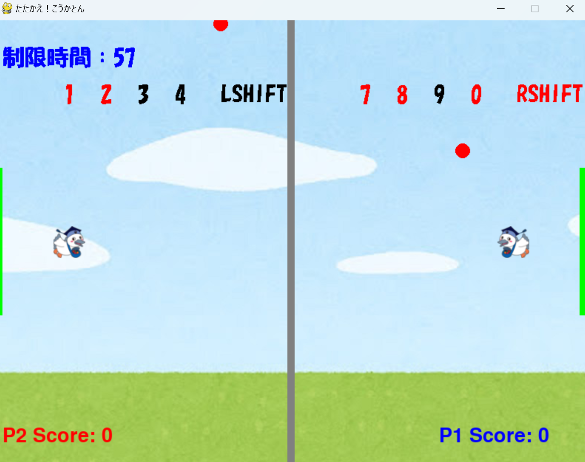
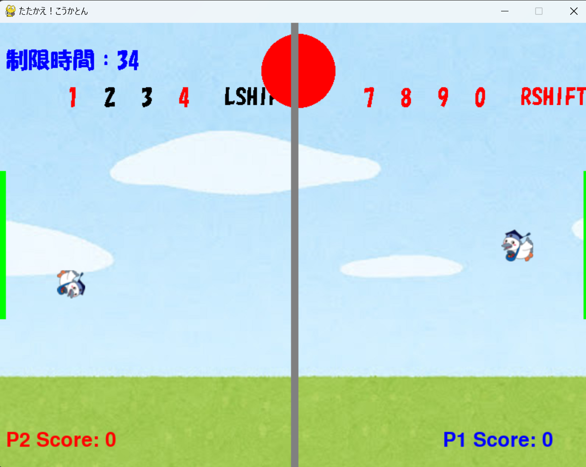
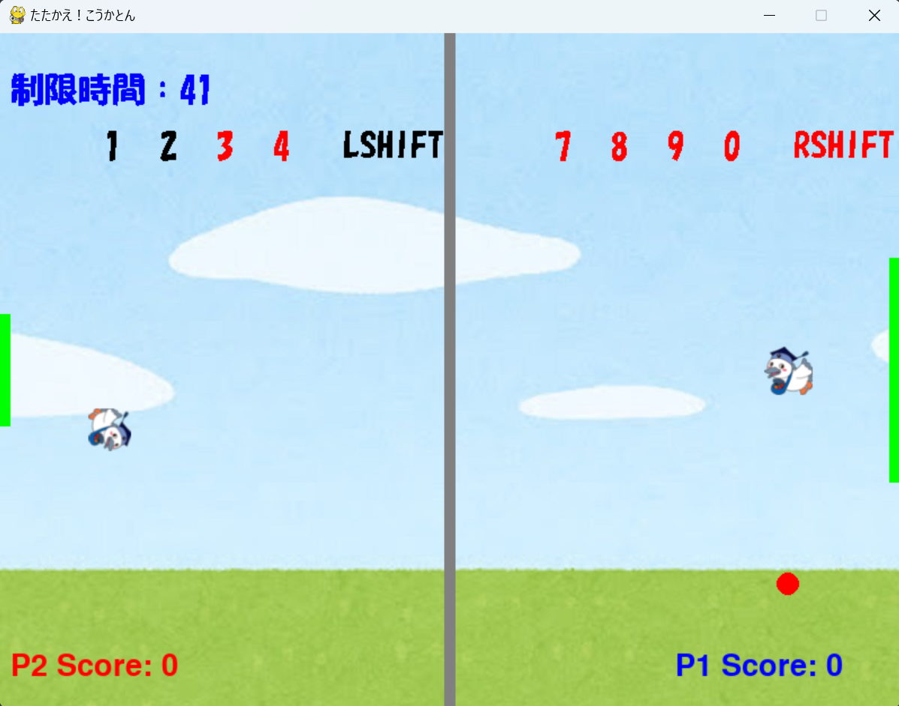
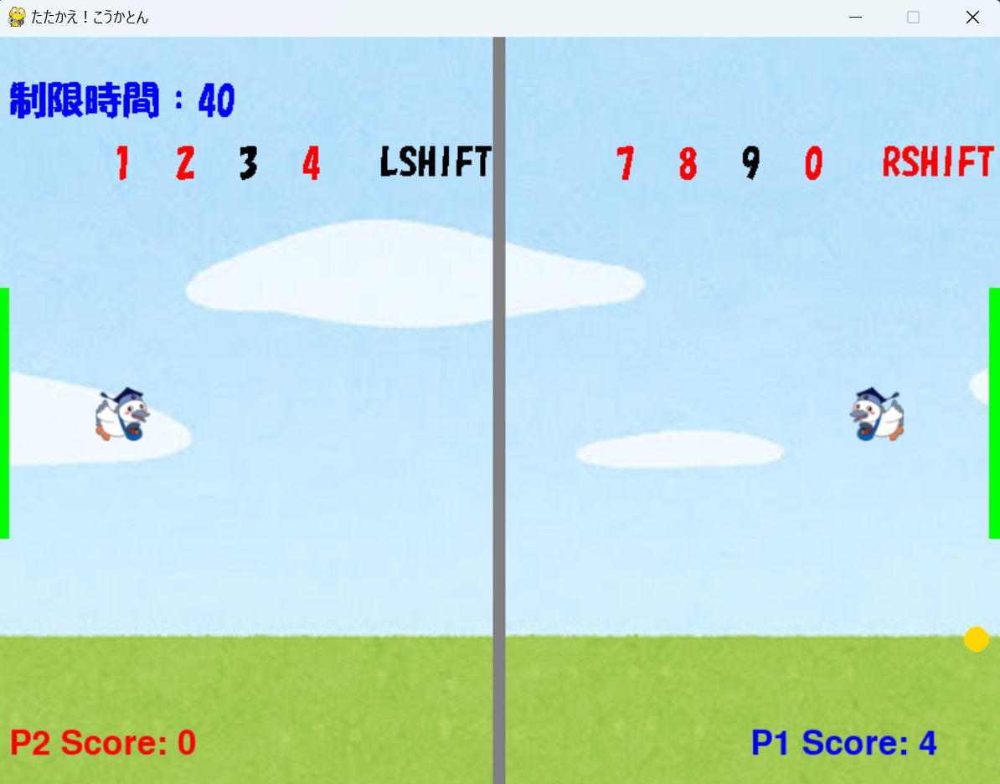

# こうかとんホッケー

## 実行環境の必要条件
* python >= 3.10
* pygame >= 2.1

## ゲームの概要
* こうかとんを操作するエアホッケー
* 60秒でゲーム終了とし、その時点で点数が多い方が勝利

## ゲームの遊び方
* IJKLキーかWASDキーでこうかとんを操作し，特定のキーを押すことによりスキル発動
* こうかとんに当たると爆弾が跳ね返り、相手のゴールに触れたら得点獲得

## ゲームの実装
### 共通基本機能
* 背景画像と1P・2Pのキャラクター描画

### 分担追加機能
* フェイクの爆弾を出す（担当：やたべ）：1P/0キー　2P/4キー　を押したらスキル発動

    ・フェイクの爆弾がもう一つ増える

    ・スキル継続時間6秒
    

* 爆弾拡大(担当：いさな)　：1P/9キー  2P/3キー　 を押したらスキル発動

    ・発動時間　4秒　　
    
    ・クールタイム　8秒
    

* 勝利画面(担当：いさな)：ゲーム終了時（制限時間０秒）にスコアによって、表示されるテキストの変化

    1Pスコア > 2Pスコア → 1P WIN

    1Pスコア < 2Pスコア → 2P WIN

    1Pスコア = 2Pスコア → DRAW

* 無敵の壁(担当：るな)　：1P/7キー  2P/1キー　を押したらスキル発動

    ・ゴールの色が黄色に
    　

    ・スキル継続時間　10秒
    

    ・クールタイム　20秒

    

* ゴール縮小(担当：るな)　：1P/8キー  2P/2キー　を押したらスキル発動

    ・ゴールの幅が半分に　　
    
    ・スキル継続時間　10秒　　
    
    ・クールタイム　15秒

    

* 中心の壁設置(担当：るな)　：中心に壁を設置し、こうかとんが自陣地からでないようにする

* スコア二倍（担当：ませ）：1１０％の確率でスコア2倍の黄色いボールを出現させる

* 一定時間停止（担当：ませ）：右シフトで左のこうかとんが左シフトで右のこうかとんが２秒間停止する。

* 爆弾とこうかとんの衝突判定（担当：おがわ）：爆弾がこうかとんに衝突した際に正しい挙動で反射するようにする

* クールタイムの簡素化（担当：おがわ）：スキル使用可能の場合は押下キーの色を赤、使用不可の場合は黒

### ToDo
- ゲームで使えるキャラクターを変更する
- ステージが変わる
- 最高スコアを保存できる

### メモ
* できるだけクラスと関数を使う
